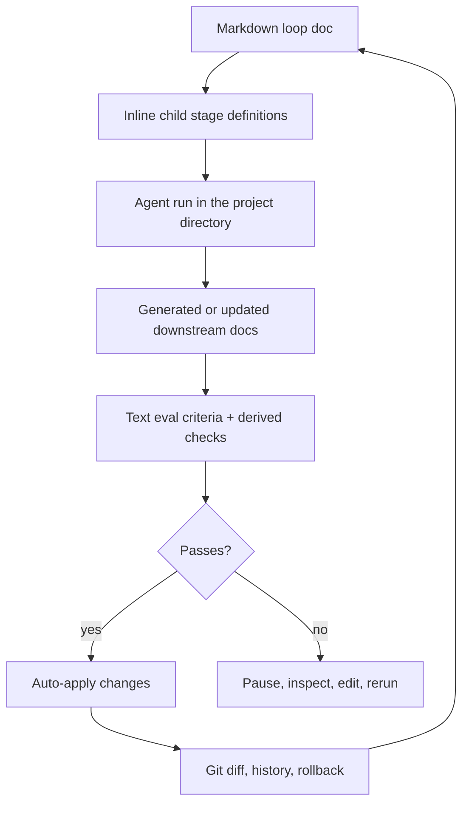

<div align="center">
  

  <h1>Sloop</h1>

  <p><strong>choose sloop not slop</strong></p>

  <p>A paper-first meta-IDE for defining, running, and supervising nested agent loops.</p>

  <p>
    
    
    
    
    
    
  </p>
</div>

## What Is Sloop?

Sloop is a local-first workspace for building software through definable agent loops. Instead of treating agents as one-off chat sessions, Sloop makes their work explicit as Markdown documents, evaluation criteria, diffs, and nested pipelines.

The main interface is a Notion-like paper surface backed by plain Markdown. A loop document can define its own child stages inline: product requirements, architecture alternatives, implementation plans, build agents, review loops, or any other workflow the user wants to invent.

## Core Ideas

- **Markdown is canonical.** Loop definitions, generated docs, maintained docs, and evaluation criteria live in Markdown, optionally with frontmatter.
- **Pipelines are user-definable.** Any loop doc can define lower stages, and those stages can define their own lower stages.
- **Every loop has evals.** Evaluation criteria are written in text first, then agents can derive deterministic checks such as tests, schemas, fixtures, or commands.
- **Git is the audit trail.** Sloop uses diffs and history to make agent changes inspectable and reversible.
- **Cascades are diff-driven.** When a parent doc changes, agents inspect the Git diff and update only the affected downstream docs or code.
- **Agents run locally through Pi.** The hackathon build uses Pi as the only external coding agent runtime.

## How It Works



## Running Sloop

Sloop runs as a CLI that operates on **the directory you launch it from** — your project's working directory. There's no separate workspace to register or import: `cd` into the repo you want to work on and Sloop treats that directory as the canonical workspace. All loop docs, generated/maintained files, and the agent's edits land directly in that tree, so Git is the single source of truth for everything Sloop does.

```bash
# from inside the project you want to work on
sloop              # initialize if needed, then serve the UI + API (opens a browser)
sloop init         # scaffold a sloop workspace here (.sloop/, databank/, git)
sloop --port 5500  # serve on a specific port (default 5174)
sloop --no-open    # serve without opening a browser
sloop --help       # full usage
sloop --version    # print the version
```

On first run in a fresh directory, Sloop scaffolds a workspace in place:

- `.sloop/` — per-run agent session state and Sloop's own runtime data.
- `databank/` — the paper surface: loop docs, ADRs, and other Markdown.
- a Git repo (initialized if the directory isn't already one) so every agent change is a diff you can inspect, history you can browse, and a commit you can roll back.

The local server owns filesystem access, Git status/diffs, and agent orchestration; the browser UI is the paper-first editing surface. Because Sloop binds to the current directory, you can run an isolated instance per project simply by launching it from a different folder.

Set a model provider key before running cascades — Sloop checks for `ANTHROPIC_API_KEY` or `NEBIUS_API_KEY` and warns if neither is present.

## Example Loop Shape

```md
---
kind: loop-doc
status: running
agent: pi
evals:
  - Requirements are complete and non-ambiguous.
  - Each downstream architecture option traces back to this PRD.
children:
  - stage: architecture
    mode: alternatives
    count: 3
  - stage: implementation-plan
    from: selected-architecture
---

# Product Requirements

Define the product, its constraints, and the criteria every child loop must satisfy.
```

## Current Direction

The hackathon version is a Vite + TypeScript app with a local Node worker/server. The frontend owns the paper-first editing experience, diff views, and loop status UI. The local worker owns filesystem access, Git status/diffs, and agent process orchestration.

Tauri and Rust are intentionally deferred for now so the prototype can move quickly.

## Pi Runtime

Sloop expects Pi to be installed globally and available as `pi` on `PATH`. Before running Sloop agent loops, log in with `pi /login`, or start interactive `pi` and run `/login`.

The runtime is configured with environment variables:

- `SLOOP_PI_COMMAND=pi` - Pi CLI command to invoke.
- `SLOOP_PI_MODEL=openai-codex/gpt-5.3-codex` - default Pi model.
- `SLOOP_PI_PROVIDER` - optional provider override.
- `SLOOP_PI_ARGS` - optional extra CLI arguments appended to the Pi invocation.
- `SLOOP_PI_SESSION_ROOT=.sloop/pi-sessions` - optional root for per-run Pi session directories.

Each Sloop run uses a per-run Pi session directory under `.sloop/pi-sessions` for runtime state, while file edits happen directly in the active project directory.

## Repo Map

- [`README.md`](README.md) - project overview.
- [`assets/sloop-concept.png`](assets/sloop-concept.png) - current concept image.

## Status

Sloop is in early design/prototype mode. The product thesis is set; implementation is next.
