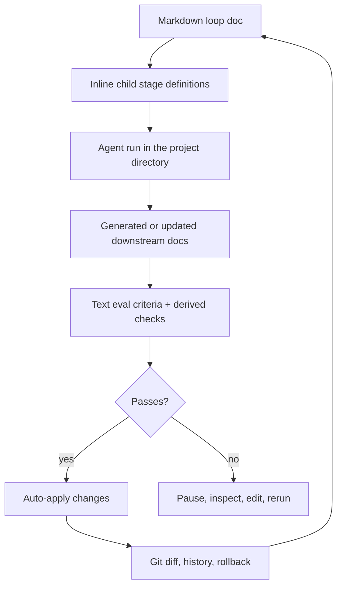

<div align="center">
  

  <h1>Sloop</h1>

  <p><strong>choose sloop not slop</strong></p>

  <p>A paper-first meta-IDE for defining, running, and supervising nested agent loops.</p>

  <p>
    
    
    
    
    
    
  </p>
</div>

## What Is Sloop?

Sloop is a local-first workspace for building software through definable agent loops. Instead of treating agents as one-off chat sessions, Sloop makes their work explicit as Markdown documents, evaluation criteria, diffs, and nested pipelines.

The main interface is a Notion-like paper surface backed by plain Markdown. A loop document can define its own child stages inline: product requirements, architecture alternatives, implementation plans, build agents, review loops, or any other workflow the user wants to invent. A plain one-line request can also bootstrap the default PRD -> architecture -> implementation plan -> code-controller cascade.

## Submission & Demo

### What We Built

Sloop is a hackathon prototype of a paper-first meta-IDE for agentic software work. It lets a user describe intent in a Markdown-backed document, define or materialize downstream loop stages, run a local Pi coding agent cascade, inspect generated docs and code diffs, and keep the whole workflow auditable through Git.

The prototype includes:

- A Vite + React document UI with a quiet sidebar, editable loop metadata, bottom status sections, history, diff views, and run controls.
- A local Node server for workspace discovery, Markdown/frontmatter parsing, Git diffs, run history, controller-doc materialization, deterministic eval commands, and Pi orchestration.
- Code-stage controller docs that turn implementation work into explicit Markdown contracts with allowed output paths, commands, retries, and failure evidence.
- A reveal.js idea deck in [`presentations/sloop-idea`](presentations/sloop-idea).

### Agent Workflow We Designed

The core workflow is a nested, document-defined agent loop:

1. A human writes or edits a loop doc, from a full PRD to a one-line intent like `create pacman`.
2. Sloop materializes or updates child stages such as PRD, architecture, implementation plan, and code controller docs.
3. Pi runs locally in the active project directory with the relevant source doc, downstream docs, inherited eval criteria, allowed output paths, and deterministic commands.
4. Sloop captures the resulting Markdown/code changes as Git diffs.
5. Evals gate the loop: passing changes can be accepted, while failing runs leave visible evidence for retry, manual edit, or review.

The important shift is that the agent is not just chatting or editing files directly. It is working inside a user-defined loop whose contract, outputs, checks, and history are inspectable.

### Key Architectural Decisions

- **Markdown is the source of truth.** Loop definitions, generated docs, maintained docs, eval criteria, and controller contracts live in plain files.
- **Frontmatter is structured but not hidden.** Common loop metadata is editable through UI controls while unknown metadata is preserved.
- **Git is the audit layer.** Diffs, history, rollback points, and cascade detection are built around the repository state.
- **Code stages always have controller docs.** Code files are outputs of a Markdown contract, not standalone workflow identity.
- **The runtime is local-first.** The hackathon build uses a local Node worker/server and Pi as the external coding-agent runtime.
- **Pipelines are user-definable.** PRD -> architecture -> plan -> code is the default shape, not a hardcoded product limit.

### Evidence, Evals, Metrics, And Learnings

We did not have time to run proper benchmark suites during the hackathon. In principle, because Sloop is a software-building harness, it can be evaluated against popular coding benchmarks such as DeepSWE or SWE-bench by running the same tasks through Sloop's loop contracts and measuring pass rates, resolved issues, test success, retries, cost, and wall-clock time.

The harder question is UX impact. Sloop is designed to improve inspectability, recoverability, and control over agent work, but those benefits are not captured well by standard coding benchmarks. They need user testing: can developers understand what the agent did, intervene safely, recover from bad cascades, and trust eval-gated changes more than they trust a raw chat transcript?

Our main learning is that agent quality is only part of the problem. The surrounding workflow matters just as much: source-of-truth docs, explicit evals, scoped outputs, visible diffs, and durable run history make agent work feel less like a black box and more like a system a developer can operate.

## Core Ideas

- **Markdown is canonical.** Loop definitions, generated docs, maintained docs, and evaluation criteria live in Markdown, optionally with frontmatter.
- **Pipelines are user-definable.** Any loop doc can define lower stages, and those stages can define their own lower stages.
- **Blank-page runs can start from intent.** A doc that only says `create pacman` can materialize downstream controller docs before Pi fills them and produces code.
- **Every loop has evals.** Evaluation criteria are written in text first, then agents can derive deterministic checks such as tests, schemas, fixtures, or commands.
- **Git is the audit trail.** Sloop uses diffs and history to make agent changes inspectable and reversible.
- **Cascades are diff-driven.** When a parent doc changes, agents inspect the Git diff and update only the affected downstream docs or code.
- **Agents run locally through Pi.** The hackathon build uses Pi as the only external coding agent runtime.

## How It Works



## Example Loop Shape

```md
---
kind: loop-doc
status: running
agent: pi
evals:
  - Requirements are complete and non-ambiguous.
  - Each downstream architecture option traces back to this PRD.
children:
  - stage: architecture
    mode: alternatives
    count: 3
  - stage: implementation-plan
    from: selected-architecture
---

# Product Requirements

Define the product, its constraints, and the criteria every child loop must satisfy.
```

## Current Direction

The hackathon version is a Vite + TypeScript app with a local Node worker/server. The frontend owns the paper-first editing experience, diff views, and loop status UI. The local worker owns filesystem access, Git status/diffs, and agent process orchestration.

Tauri and Rust are intentionally deferred for now so the prototype can move quickly.

## Pi Runtime

Sloop expects Pi to be installed globally and available as `pi` on `PATH`. Before running Sloop agent loops, log in with `pi /login`, or start interactive `pi` and run `/login`.

The runtime is configured with environment variables:

- `SLOOP_PI_COMMAND=pi` - Pi CLI command to invoke.
- `SLOOP_PI_MODEL=openai-codex/gpt-5.3-codex` - default Pi model.
- `SLOOP_PI_PROVIDER` - optional provider override.
- `SLOOP_PI_ARGS` - optional extra CLI arguments appended to the Pi invocation.
- `SLOOP_PI_SESSION_ROOT=.sloop/pi-sessions` - optional root for per-run Pi session directories.

Each Sloop run uses a per-run Pi session directory under `.sloop/pi-sessions` for runtime state, while file edits happen directly in the active project directory.

## Repo Map

- [`README.md`](README.md) - project overview.
- [`assets/sloop-concept.png`](assets/sloop-concept.png) - current concept image.

## Status

Sloop is in early design/prototype mode. The product thesis is set; implementation is next.
