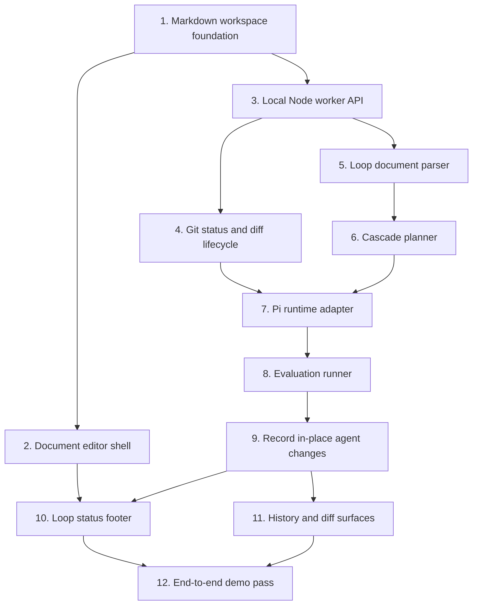

# Sloop Hackathon Build DAG

Date: 2026-06-13

## Runtime Decision

- Sloop uses Pi mono as the only agent runtime.
- The server-side adapter invokes the Pi coding agent CLI from the active project directory.
- Runtime documentation should refer generically to Pi, the Pi coding agent CLI, and the Pi agent core package.
- Do not introduce alternate agent runtime adapters in the hackathon build plan.

## Pi Runtime Configuration

- Sloop expects Pi to be installed globally and available as `pi` on `PATH`.
- Before running Sloop agent loops, authenticate Pi globally with `pi /login`, or start interactive `pi` and run `/login`.
- Sloop uses Pi only; do not document Codex, Claude, or other runtime adapters as supported hackathon runtimes.
- The default command is `SLOOP_PI_COMMAND=pi`.
- The default model is `SLOOP_PI_MODEL=openai-codex/gpt-5.3-codex`.
- `SLOOP_PI_PROVIDER` is optional and should be passed through only when set.
- `SLOOP_PI_ARGS` is optional extra CLI arguments appended to the Pi invocation.
- `SLOOP_PI_SESSION_ROOT` optionally overrides the root directory used for per-run Pi sessions.
- Each run should use its own session directory under `.sloop/pi-sessions` so Pi state stays isolated per run.

## Implementation DAG

## Subagent Work Packages

Each package should be assigned to a focused subagent with a disjoint write set where possible. Subagents should coordinate through Markdown specs, Git diffs, and explicit evaluation criteria rather than shared hidden state.

1. Markdown workspace foundation
   - Define the sample loop document layout and file conventions.
   - Write set: sample Markdown documents and docs.

2. Document editor shell
   - Build the BlockNote Mantine document-first editing surface.
   - Write set: frontend editor components and styles.

3. Local Node worker API
   - Add filesystem, document save/load, and run orchestration endpoints.
   - Write set: server worker modules and API client glue.

4. Git status and diff lifecycle
   - Implement diff capture and project change tracking.
   - Write set: server Git utilities and tests.

5. Loop document parser
   - Parse Markdown/frontmatter loop definitions, child stages, and evaluation criteria.
   - Write set: parsing utilities and parser tests.

6. Cascade planner
   - Determine affected downstream loop docs from Git diffs and loop definitions.
   - Write set: cascade planning module and fixtures.

7. Pi runtime adapter
   - Invoke the Pi coding agent CLI from the active project directory.
   - Read Pi configuration from `SLOOP_PI_COMMAND`, `SLOOP_PI_MODEL`, optional `SLOOP_PI_PROVIDER`, optional `SLOOP_PI_ARGS`, and optional `SLOOP_PI_SESSION_ROOT`.
   - Allocate a per-run Pi session directory under `.sloop/pi-sessions`.
   - Pass loop context, diffs, instructions, and evaluation criteria to Pi.
   - Write set: Pi adapter module and adapter tests.

8. Evaluation runner
   - Run deterministic checks derived from textual criteria, then report pass/fail state.
   - Write set: evaluation runner and test fixtures.

9. Record in-place agent changes
   - Record passing and failing Pi changes in run history.
   - Leave file edits visible in the active project directory for review and continuation.
   - Write set: run-state and Git application modules.

10. Loop status footer
    - Show running child loops, pause/resume state, evaluation results, and links to child docs.
    - Write set: frontend status footer components.

11. History and diff surfaces
    - Add run history, full diff viewing, rollback points, and provenance display.
    - Write set: frontend history/diff components and server read APIs.

12. End-to-end demo pass
    - Wire the document editor, Node worker, Git diff lifecycle, Pi runtime adapter, evaluation, and run history into a hackathon demo.
    - Write set: integration glue, seed docs, and e2e tests.

## Execution Notes

- Run agents directly in the active project directory.
- Use Pi as the only external coding agent runtime.
- Require a globally installed and logged-in Pi CLI before agent runs; use `pi /login` or interactive `pi` then `/login`.
- Keep Pi runtime state in per-run directories under `.sloop/pi-sessions`.
- Treat Markdown as the canonical source of truth; derived indexes must be rebuildable.
- Evaluation gates must pass before changes are applied back to the main workspace.
- Agents may update loop Markdown directly when the loop instructions ask them to.
